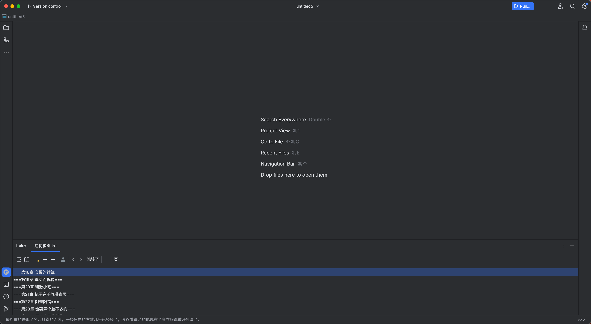
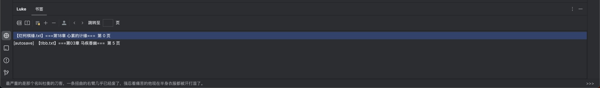
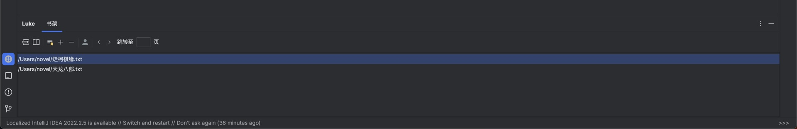
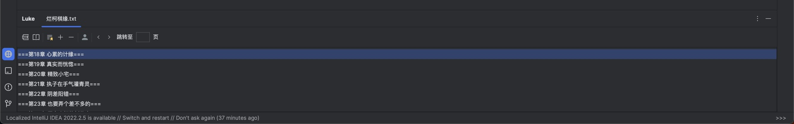
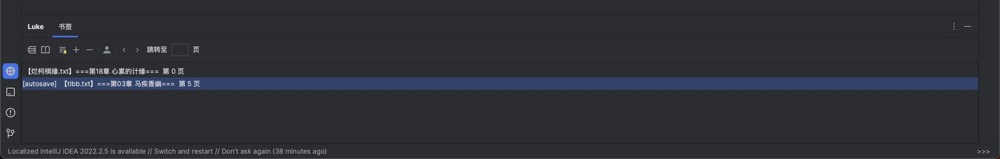

# LukeReader

LukeReader是一个可以在IDEA中阅读小说的插件，拥有隐蔽的阅读体验和极佳的交互设计。

无论你是在工作还是学习，都可以通过LukeReader来享受小说的乐趣，而不必离开IDEA。

下载地址：https://plugins.jetbrains.com/plugin/23233-luke-reader

**插件免费试用30天，如果你喜欢，请订阅支持。**

### 安装
在IDEA的插件市场搜索 **Luke Reader**。

IDEA市场：https://plugins.jetbrains.com/plugin/23233-luke-reader

### 🚀 极简使用流程
- 准备好你的小说 txt 文件，并放置在一个单独的目录下。
- 依次选择 Settings -> Luke Reader -> 小说文件夹，选择您的小说目录。
- 打开 Luke 工具窗口，双击选择书籍、章节。
  - 如果找不到工具窗口可能是被折叠，点击侧边栏的"···"尝试寻找
- 点击右下角'>>>'进行翻页，双击进行隐藏。内容会展示在IDEA左下角。
  - **如果你使用了 IDEA 的newUI，底部状态栏可能会展示为导航栏。这时点击 View > Appearance > Navigation Bar > Top ，就可以将导航栏移到顶部，再次双击章节即可展示小说内容**
- 此外，还可以自定义快捷键，包括翻页、切换章节、隐秘阅读（老板键）等。

### 主要特点

#### 隐藏的阅读框
LukeReader插件的阅读框巧妙地隐藏在左下角，几乎不会引起他人的注意。

#### 多种体验优化
LukeReader插件致力于提供最佳的阅读体验。它包括以下功能和优化：

- **工具栏小部件**：鼠标访问常用功能的工具栏小部件，提供了书架列表、目录列表、书签管理等功能

- **优雅操控**：提供丰富的快捷键和鼠标操作，使你能够轻松操作插件。

- **性能优化**：插件经过优化，确保在阅读小说时不会影响IDEA的性能。

#### 支持本地多本小说
LukeReader插件支持在本地加载多本小说，让你能够随时切换阅读不同的小说。你可以在IDEA中轻松管理你的小说收藏。

#### 多种算法识别目录
LukeReader使用多种智能算法来识别小说的目录结构，以便你可以轻松地浏览和导航到不同的章节和页面。

#### 支持书签功能
你可以在LukeReader中创建和管理书签，以便在阅读过程中轻松返回到感兴趣的页面，无需再次翻找。

### 常见问题（FAQ）

#### 为什么安装后找不到工具窗口？
工具窗口可能被折叠了，您可以点击 IDEA 侧边栏的"···"按钮，在展开的菜单中查找 Luke Reader 的图标。

#### 为什么在底部状态栏看不到小说内容？
这种情况通常出现在使用 IDEA 新版UI（newUI）时。因为在新版UI中，底部状态栏会变成导航栏的形式。解决方法是：
1. 点击顶部菜单栏的 View > Appearance > Navigation Bar > Top
2. 这样会将导航栏移到顶部
3. 然后重新双击章节，小说内容就会正常显示在底部状态栏了

#### 为什么底部状态栏只显示 ">>" ？
当内容处于隐藏状态时，状态栏会显示 ">>"。您只需 双击 右下角的 ">>>" 即可切换内容的显示与隐藏状态。

#### 是否支持快捷键操作？
支持。您可以通过以下步骤设置快捷键：
1. 在 IDEA 中打开 Settings > Keymap
2. 在右侧找到 Plugins > Luke Reader
3. 可以设置以下5个快捷键功能：
   - 上一页
   - 下一页
   - 上一章
   - 下一章
   - 隐藏/展示（老板键）

#### 为什么小说目录识别不准确？
目前插件已支持大多数常见的小说格式，但可能有些特殊格式还未适配。如果遇到目录识别问题，您可以：
1. 在 GitHub 上提交 issue
2. 上传您的小说文件
3. 我们会进行格式适配
4. 适配完成后会通知您
5. 重启 IDEA 并重命名小说文件，即可看到正确的目录结构

#### 无法联网的设备如何订阅使用？
可以通过以下步骤完成离线订阅：
1. 使用其他可联网设备访问：https://zhanzhan99.cn/public/payment
2. 按照提示购买激活码
3. 在插件设置页面提交激活码即可

请注意：离线订阅仅支持永久订阅，且不支持退款。

#### 是否收集用户个人信息？
我们只使用 IDEA 提供的唯一设备ID作为用户标识，无需用户登录注册，也不会收集任何用户个人信息。

#### 订阅支持几个设备？如何更换设备？
- 每个订阅仅支持一个设备使用
- 如需更换设备，请提供：
  1. 旧设备的付款截图或用户ID
  2. 新设备的用户ID
- 我们会在后台为您处理设备更换

## 联系我们

如果你在使用LukeReader插件时遇到任何问题，或者有任何建议或反馈，请随时告诉我们！
您可以通过以下方式联系我们：
- （推荐）添加客服微信：luke_reader
- 发送邮件至：support@zhanzhan99.cn
- 提交 GitHub issue