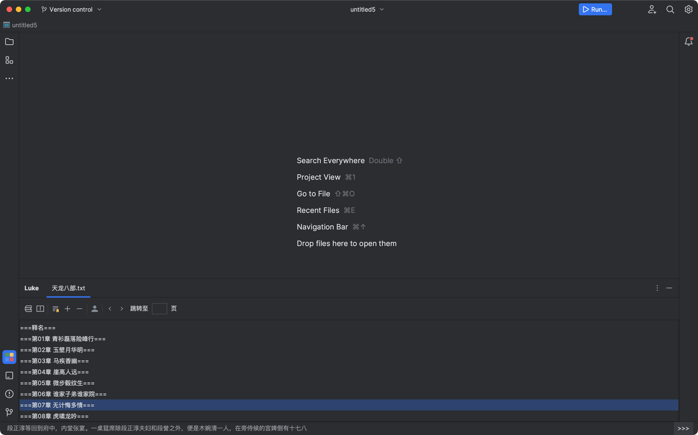

# LukeReader

LukeReader是一个适合摸鱼的绝佳IDEA插件，提供极具隐蔽性的阅读体验。
无论你是在工作还是学习，都可以通过LukeReader来享受小说的乐趣，而不必离开IDEA。

下载地址：https://plugins.jetbrains.com/plugin/23233-luke-reader

**插件免费试用30天，如果你喜欢，请订阅支持。**

## 安装

要安装LukeReader插件，只需按照以下步骤操作：

1. 打开IntelliJ IDEA。
2. 转到 "Settings" > "Plugins"。
3. 在搜索框中输入 "Luke Reader"。
4. 点击 "Install" 安装插件。

## 使用
- 点击Settings > Luke Reader

- 设置本地小说路径，选择一个包含 txt 文件的小说文件夹

- 点击快捷键设置，一次选择 Plugin > Luke Reader 设置快捷键

- 点击工具栏的 Luke tab，双击小说、选择章节并双击，内容就在状态栏展示啦
   - **如果你使用了 IDEA 的newUI，底部状态栏可能会展示为导航栏。这时点击 View > Appearance > Navigation Bar > Top ，就可以将导航栏移到顶部，再次双击章节即可展示小说内容**
- 使用鼠标点击右下角的">>>"或者使用快捷键进行翻页

## 主要特点

### 隐藏的阅读框
LukeReader插件的阅读框巧妙地隐藏在左下角，几乎不会引起他人的注意。

### 多种体验优化
LukeReader插件致力于提供最佳的阅读体验。它包括以下功能和优化：

- **工具栏小部件**：鼠标访问常用功能的工具栏小部件，方便你控制阅读进程。

- **多种快捷键**：提供丰富的快捷键，使你能够在不离开键盘的情况下轻松操作插件。

- **性能优化**：插件经过优化，确保在阅读小说时不会影响IDEA的性能。

### 支持本地多本小说
LukeReader插件支持在本地加载多本小说，让你能够随时切换阅读不同的小说。你可以在IDEA中轻松管理你的小说收藏。

### 多种算法识别目录
LukeReader使用多种智能算法来识别小说的目录结构，以便你可以轻松地浏览和导航到不同的章节和页面。

### 支持书签功能
你可以在LukeReader中创建和管理书签，以便在阅读过程中轻松返回到感兴趣的页面，无需再次翻找。

## 反馈与支持

如果你在使用LukeReader插件时遇到任何问题，或者有任何建议或反馈，请随时联系我们。

祝你摸鱼愉快！